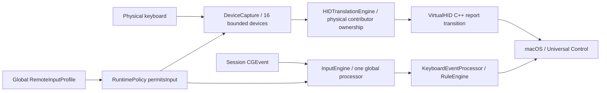
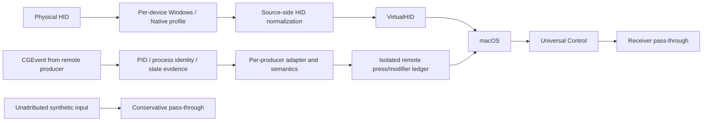

# Unified Windows Keyboard Experience：架構與驗證

日期：2026-10-01。基準：main f39d70b / 0.5.14 build 26；候選版：0.5.15 build 27，分支 `codex/unified-windows-input-layer`。

**結論：已實際重構、修復並執行完整自動測試／建置；尚未達成六個實機路徑全部驗收，不能宣稱可正式上線。** 本報告把程式證據與實體驗收分開。沒有自行安裝／啟動 App、helper、Driver，沒有改 TCC、鍵盤映射或連線到其他電腦，也沒有讀取一般按鍵、文件或 Clipboard 內容。

## 修改前實際 call chain

- Physical：IOHID callback 保有 registry device ID；helper 翻譯後由 VirtualHID 輸出。CGEvent 階段沒有本程式可依賴的公開鍵盤 device ID。
- EventTap：InputEngine 將所有事件交給同一 processor，沒有讀取 creator PID/state 來識別 remote producer；只讀自身 synthetic marker 防循環。
- UC：DeviceCapture 排除 Universal Control、VirtualHID、virtual keyboard，因此在 HID 接收端沒有第二次翻譯。原先 global sender/receiver 角色也會停掉接收端自己的實體鍵盤，反方向操作時需手動改角色。
- Remote：HID 同時排除 remote virtual input，EventTap 在 HID backend 被停用。即使 Google 背景 host 注入 raw Ctrl，也沒有獨立 normalization 路徑。
- RemoteInputProfile：settings → BridgeController.publish → input.remoteProfile → permitsInput/PhysicalNormalization → config.enabled；sourceSuspension、Fn mapping、UI timer 亦受 global role 影響。

## 可確認的來源資訊與證據

Apple 公開提供 CGEvent source PID、source state ID、user data；state table 是 aggregate state，**不是可靠 device identity、remote peer OS、connection ID 或「已翻譯」證明**。不能把 private/combined/hid state 當作單獨的來源驗證。

- [CGEventField.eventSourceUnixProcessID](https://developer.apple.com/documentation/coregraphics/cgeventfield/eventsourceunixprocessid)
- [CGEventSourceStateID](https://developer.apple.com/documentation/coregraphics/cgeventsourcestateid)
- [Google Chromium Mac input injector](https://chromium.googlesource.com/chromium/src/+/refs/heads/main/remoting/host/input_injector_mac.cc)
- [Google Chromium branding](https://chromium.googlesource.com/chromium/src/+/refs/heads/main/remoting/branding_Chrome)

本機 readonly metadata 實際辨識 Google host PID 1079，signing identifier `com.google.chromeremotedesktop.me2me-host`、TeamIdentifier `EQHXZ8M8AV`、signatureValid=true；Apple UC PID 762、identifier `com.apple.universalcontrol`、signatureValid=true。Google supervisor PID 748 的實際 signing ID 是 `remoting_me2me_host_service`，維持 Unknown／Generic，沒有把 supervisor 身份當成已驗證的 injector。PID 僅代表本次快照，重啟會改變。沒有讀取 remote credentials/config 或普通打字。建立但未 post 的真正 CGEvent 顯示 creator PID 是建立者、source state=0（combined）；Control keyboard event 的 type 是 flagsChanged。紀錄：`build/unified-verification/producer-metadata.json`。

Google host 原始碼維護左右 modifier 狀態，將 flags 明確寫進 CGEvent，再 post 到 session tap。這證明可設計 creator-PID adapter 與來源獨立 flags 路徑；**不證明 Windows client 的實際設定／傳輸、macOS 此版本的事件 PID 保留、UC forwarding 或六個 acceptance cases 已完成**。

## 修改後架構與不可混淆的邊界

不新增 LAN discovery、雙端 handshake 或 network metadata。HID 與 remote EventTap 可以並存，但只讓經分類的 remote producer 進 remote processor；hardware／本程式輸出／UC 不能進該路徑。EventTap-only fallback 無公開 device identity，不能將其宣稱與 HID 的 UC／per-device ownership 等價。

Remote override、learning 與 session epoch 必須只作用於該 producer；本機 policy、Fn mapping、HID generation 不受 remote preference 影響。一般 UC 使用不再提供 sender/receiver 全域切換。

Source-side UC 仍有需要實測的架構邊界：來源端只知道本機 foreground context，沒有公開目的端 App context；Terminal/Finder 等 context-specific 規則與 AX action 不能憑空得知 UC 接收端焦點。沒有假造 API 或聲稱已解決此跨機 context 問題。

## 根本原因與實際修正

| 問題／根因 | 實際修改 | 仍需驗證的邊界 |
|---|---|---|
| UC 以前需要手動角色：global role 以停掉整個接收端降低重複翻譯，連接收端本機鍵盤也一起停掉 | 移除 `RemoteInputProfile`、sender／receiver UI 與所有 role→runtime／Fn／timer gating；實體來源走 HID，UC／virtual 接收事件通過 | EventTap fallback 無法可靠識別所有未保留 PID 的 UC 事件；跨機目的端 App context 不可得 |
| Remote 不能套 UC 解法：Windows 來源沒有 Bridge，接收 raw Ctrl 時仍要翻譯；某些 client 已送出 Cmd | 同一個 session EventTap 在 HID 模式只處理已分類的 remote producer；Google Automatic 識別 raw Ctrl，而 Cmd chord 通過 | 不能由 source state 推斷 peer OS 或「已翻譯」；模糊事件保守通過 |
| Global remote profile 不合理：一個來源的語意設定控制所有鍵盤 | Settings schema 5 儲存逐來源 preference，physical policy 不包含 remote/device preference；來源替換只撤銷自己的 gate | preference 綁 host executable identity，不是遠端 peer／連線 ID |
| EventTap 缺少來源 ledger，來源 A 的 Ctrl／C 可能影響 B | 最多16個 `(PID, birth session, stateID)` stream，每個獨立 modifiers、128 press、frame gate；physical HID ledger 保留獨立16裝置／256 press | OS 最終 aggregate flags 的多來源交錯仍須實機驗收，unit ledger 獨立不等於 WindowServer 已驗收 |
| MacBook 新安裝預設交換 Fn／Ctrl，真正 Control 無法與外接鍵盤一致 | 新／缺欄預設 Fn swap=false、HID、Win=Command，Apple 裝置也提供 Windows Experience；明確舊設定保留 | 內建 HID descriptor、Fn／Globe／Touch ID／function row 實際 forwarding 待驗收 |
| 沒有可恢復的逐裝置 Native Mac 偏好 | 穩定 hardware metadata digest；有 serial 時不綁 USB port，無 serial 時綁 location；Native 只交回自己的服務 | 同型無 serial 鍵盤換 USB port 可能是不同偏好；不記原始 serial |
| 新增／拔除裝置會停掉其他鍵盤的 active Ctrl | 逐 contributor disconnect；新／重新啟用裝置只等自己的 neutral；最後一個 captured 裝置離開才停止 lifecycle | seize／reopen gap、真正 USB／Bluetooth disconnect 待驗收 |
| device preference 不應重置其他裝置 generation，但晚到 helper action 仍可能執行 | IPC version 4 加獨立 `actionGeneration`，清舊 action queue；回覆及 action 同時驗 physical generation／action epoch；App 的本機 action 用獨立 local epoch 取消 | App／helper 必須同版更新；舊 protocol 不會偷偷沿用 |
| Remote screenshot／AX 工作不能只驗全域 generation | producer origin gate＋frame gate＋PID/birth；非同步完成時直接核對存活程序，不依賴下一次registry tick。在 source replacement／host transition／失聯 lease 時撤銷；AX 執行前後、截圖完成／處理後／Clipboard 寫入前再次驗證 | 沒有公開 remote connection-end event；同 PID 的 network loss 依 host 上游 key-up 或60秒 idle held-state lease |
| 右 Alt 原生 App 切換清理時固定釋放 Left Command | 記錄這次 App-switch 使用的 Command 側；normal release、focus／policy change、lease expiry 使用一致的側；擴充固定 release buffer 包含16個 latch | 沒有重新加入自製 MRU／AX window switcher，仍使用 macOS 原生 Cmd+Tab |
| 系統App開啟是非同步OS工作，舊流程完成時未再驗request | 先background open，完成後再驗generation／source／pause／foreground，有效才activate；system/window使用有界10秒期限，Finder/screenshot仍0.6秒；新增可延遲opener及首次啟動超過1秒的integration test | 已交給OS的process launch無取消API；不能撤銷launch，但舊工作不再由Bridge啟用前景或發布過期結果 |
| Unknown origin 靠前景猜測可能雙重翻譯 | 事件 metadata inbox→單一 bounded process/signature worker→immutable routing snapshot；Known／Likely／Unknown 與 support level 分開 | 未歸屬／PID隱藏的 virtual input 通過，不猜成Windows |
| Source gate使用try-lock，競爭會把有效來源誤判失效，可能漏已翻譯key-up | 改成C11 lock-free atomic_bool，acquire讀取／release撤銷，ARC持有期間保留allocation、deinit釋放；compile-time檢查lock-free，不使用macOS15才提供的Synchronization.Atomic | 8個並行reader／160,000次驗證，不會憑空revocation；真正invalidate仍立即拒絕工作，無新增timer |

前批 P0 修正（Ctrl+C→Tab、重疊 chord、Finder cut/delete、AX close、Screenshot failure 分類、首次安裝與 staging rollback）保留在 production，所有原有測試仍重跑；詳見 [前批報告](PreReleaseRepair-2026-09-30.md)。

## Input Source Classification

| 類別 | 可用證據 | ownership／處理 |
|---|---|---|
| Physical | IOHID service registry ID、bounded descriptor、BuiltIn、vendor/product、transport、location／serial digest | helper 依 scope／逐裝置偏好 seize；未知 composite mouse／multitouch／axis 不接管。Apple vendor 不會自行關掉 Windows Experience |
| UC | HID product／VirtualHIDDevice／virtual transport 排除；若事件 PID 可取得，簽章有效且 System Library 內的 `com.apple.universalcontrol` | HID 來源端先正規化；接收端通過。排除不是傳輸完成證明 |
| Remote | CGEvent creator PID→proc birth/executable→SecCode signing ID、team、validity→adapter；snapshot 固定容量 | 逐 producer 獨立 normalization；同 PID 的 stateID 變化不與別的來源共用按鍵 |
| Bridge output／Virtual | 自身 user-data marker／自身 PID；HID virtual 屬性／名稱／vendor 排除 | 通過，防循環。HID 模式任何未分類 session 事件都不交給 physical processor |
| Unknown | 未列 catalog 的合成 PID，或來源 PID 無法解析／為0且無可靠 device identity | 可辨識 producer 才能逐來源 calibration／manual override；無法歸屬者通過。不能提供虛假的 per-device EventTap override |
| EventTap physical fallback | backend 明確是 EventTap、PID=0、sourceState=1，且沒有已辨識 producer | 僅支援 all keyboards 且無 Native Mac override；否則停止實體翻譯，classified remote 仍可獨立處理。不能把這個條件當成可靠 UC identity |

creator PID 優先於 aggregate state。source state／user data 是事件證據，不是 peer authentication 或 remote session ID；簽章 catalog 驗證的是程序身份。MainActor UI 只顯示真實 snapshot，沒有硬寫「已觀察事件」或「Verified」。

## Remote Adapter Table

`Verified` 必須有真實 client→Mac 按鍵驗收紀錄；**本次沒有任何 transport 達到 Verified**。`Detected` 代表辨識到明確 host adapter；`Generic` 是可歸屬 producer 的明確語意 override／learning；`Unknown` 尚無可靠 origin/semantics。Known／Likely／Unknown 是身份 confidence，與功能驗收等級不同。

| Transport | Detection mechanism／目前證據 | modifier 行為／normalization | Confidence／test status |
|---|---|---|---|
| Chrome Remote Desktop／Google Remote Desktop | 有效 Google host signing ID＋Team EQHXZ8M8AV＋事件 PID；實際 PID1079 metadata 通過。一般 Chrome 不符合 host catalog；supervisor 仍未知 | Chromium injector 寫自己的 flags。Automatic 轉 raw Ctrl、無修飾 Home/End、Alt+Tab/F4/PrintScreen；已是 Cmd、模糊 Option navigation 保留。explicit Windows 支援完整 Windows 規則 | Known／Detected；unit＋readonly metadata PASS；Windows→Mac／MacBook未驗收 |
| Microsoft Remote Desktop／Windows App | 現有 repo client ID `com.microsoft.rdc.macos` 只作 candidate；背景 incoming producer 必須由實際事件 PID 解析 | 沒有已觀察 incoming modifier 記錄；Automatic 通過，逐來源校準或 Windows／Already Translated override | Likely candidate／Generic 或 Unknown；真實 incoming host未驗收 |
| Jump Desktop | repo candidate `com.p5sys.jump.mac.viewer`／`.viewer.web`；viewer 不等於 Jump Connect injector | 未觀察；實際 producer 分開校準，不能憑 viewer 名稱全域翻譯 | Likely candidate／Generic 或 Unknown；未驗收 |
| AnyDesk | candidate `com.anydesk.AnyDesk`＋實際事件 PID／process identity | 未觀察；explicit per-source Windows／Mac／Already Translated／calibration | Likely candidate／Generic 或 Unknown；未驗收 |
| TeamViewer | candidate `com.teamviewer.TeamViewer`；helper可能是不同身份 | 未觀察；實際 injector 才有獨立偏好，helper 不自動繼承 client | Likely candidate／Generic 或 Unknown；未驗收 |
| Parsec | candidate `tv.parsec.www`，不是已證明的 incoming Mac injector | 未觀察；有事件 creator PID 才能 generic normalize | Likely candidate／Generic 或 Unknown；未驗收 |
| RustDesk | candidate `com.carriez.RustDesk`；服務／虛擬 driver 要分別識別 | 未觀察；可歸屬 producer 的校準／override | Likely candidate／Generic 或 Unknown；未驗收 |
| Splashtop | discovery 路徑候選＋事件 producer identity；未硬加猜測的 Known signing ID | 未觀察；手動把這個 producer 關聯 Splashtop，語意獨立校準 | Unknown／Generic；未驗收 |
| NoMachine | candidate `com.nomachine.nxdock` 僅為 software candidate；daemon 需真實 PID | 未觀察；daemon若可歸屬使用 Generic，無PID則通過 | Likely candidate／Generic 或 Unknown；未驗收 |
| VNC | `com.realvnc.vncviewer` 僅 viewer candidate；其他 VNC／Screen Sharing 不假稱同一 injector | 未觀察；各 producer 校準；未知 virtual HID 通過 | Likely candidate／Generic 或 Unknown；未驗收 |
| Generic Remote／Virtual | 實際事件 PID＋path/signature identity；stable digest持久化 | Auto通過；一次 Ctrl+C calibration 只記錄 Control／Command，不保存普通打字；manual transport關聯不提升Verified | Unknown／Generic；校準、持久化、bounded inbox unit PASS；無來源者不可校準 |

候選 ID 是現有 App 保護 registry／catalog 的資訊，沒有因它出現在表格就宣稱已支援 incoming transport。除 Google 之外，獨立 flags 不能假定可靠：explicit Generic Windows 只用該 PID 的 modifier edges，不取別的鍵盤 aggregate flags。若傳輸隱藏 edges，也可能無法 normalization。

## Settings、UI 與遷移

- 一般頁新增 Windows Experience、UC自動模式、Remote自動偵測；進階頁顯示真實 producer、語意、confidence、support、是否實際看到來源事件。
- 逐裝置 Windows／Native Mac；逐 remote source Automatic／Windows／macOS／Already Translated。未知軟體可手動關聯 transport，但名稱不影響 confidence／驗收。
- 校準需使用者明確啟動，60秒有效，僅觀察該 source 的一次 Ctrl+C；結果仍驗同 PID、birth session，正常已知 Google 不要求每次校準。
- schema5忽略舊全域 role，下次保存移除；無法把「Mac Receiver」安全移轉成所有來源的語意，所以不猜。既有 explicit EventTap、Win位置、Fn swap、App rules、input-source preferences保留。
- 新安裝 Device HID／Win=Command／Fn swap=false。缺少backend的舊設定保留EventTap，避免無聲安裝Driver。設定最多64KiB、32 remote preference／16 device preference，重複identity或未來schema fail closed，保留原始資料。
- HID Windows profile依保存Win位置正規化Option／Command；Apple鍵盤使用Ctrl做Windows操作。需要原本全部Mac鍵帽行為的裝置選Native Mac，不把它與Windowsprofile的物理Cmd位置混淆。
- 整合ZIP含App/helper/固定版Driver；DMG只有App，提示需要整合ZIP或明確選EventTap備援，沒有「預設HID但免Driver自動開始」矛盾文案。

## 修改檔案、Type／Function、理由

| File | Type／Function | Change／Reason |
|---|---|---|
| Package.swift | BridgeWorkGate target／BridgeCore dependency | 小型C11 atomic module，維持macOS14最低版本 |
| Sources/BridgeWorkGate/include/BridgeWorkGate.h（新） | opaque atomic gate C API | 只提供create/destroy/current/invalidate，不輸出鍵盤資料 |
| Sources/BridgeWorkGate/BridgeWorkGate.c（新） | lock-free atomic_bool | 避免try-lock競爭漏keyup，所有gate讀取不阻塞 |
| Sources/BridgeCore/InputSources.swift（新） | RemoteProducer、InputRoutingSnapshot、SourceWorkGate、InputProducerInbox | 來源identity／confidence／policy與固定容量metadata inbox；非同步工作撤銷token |
| Sources/BridgeCore/RemoteSourceRouter.swift（新） | RemoteSourceRouter | 16來源ledger、Google/Generic語意、native App switch側追蹤、60秒持鍵lease、逐來源release |
| Sources/BridgeCore/PhysicalDevicePolicy.swift（新） | identity／isVirtual／selected | 穩定逐裝置偏好；Apple不自動native；虛擬服務排除 |
| Sources/BridgeCore/RuntimePolicy.swift | RuntimePolicyInput／Snapshot／WakePlan | 移除全域remote role對physical、Fn與timer gating |
| Sources/BridgeCore/BackendCapabilities.swift | supports | EventTap無deviceID時不能假套Native Mac偏好 |
| Sources/BridgeCore/Model.swift | ModifierStateMachine／KeyboardEvent | aggregate修復保留左右側；allowsTranslation只控制新匹配 |
| Sources/BridgeCore/KeyboardEventProcessor.swift | configure／match／reconcileIndependentSourceFlags | 共用semantic rules、原生App switch與screenshot action、paired key-up不重匹配 |
| Sources/BridgePlatform/RemoteInputAdapters.swift（新） | Catalog／Resolver／Registry／CalibrationInbox | PID/birth/signature adapter、單一background job、metadata CLI、逐來源一次校準 |
| Sources/BridgePlatform/InputEngine.swift | configureProcessor／handle／tick／update | HID下只處理classified remote；自有／UC通過；source token、固定release queue、HID不新增250ms timer；取消本機偏好舊工作 |
| Sources/BridgePlatform/ShortcutActionDispatcher.swift | Request／cancelLocalPending／isCurrent／SystemApplicationOpening | Source gate、live PID/birth與local epoch；程序查詢在callback外且不占dispatcher lock；有界16請求、一個drain；async open完成才驗證後activate。測試可注入authorization／clock／opener，正式預設保留真實TCC與deadline |
| Sources/BridgePlatform/ScreenshotManager.swift | applyInputRouting／applyPhysicalPreferences／requestCapture | screenshot source gate＋live PID/birth validity及local preference取消；head tap不重複攔remote／UC |
| Sources/BridgePlatform/HIDBackendClient.swift | update／tick／drainActions | action epoch與physical generation分離；限IPC大小／device數量／回覆驗證 |
| Sources/BridgePlatform/SettingsStore.swift | BridgeSettings／migration／physicalPolicySettings | schema5、逐來源／裝置偏好、統一新預設、有界設定、舊role移除 |
| Sources/HIDProtocol/HIDProtocol.swift | HIDConfiguration／HIDStatus／HIDDeviceStatus | protocol4、actionGeneration、16裝置偏好及狀態 |
| Sources/WindowsMacBridge/BridgeController.swift | publish／tick／source setters | 單一host transition，remote-only更新不停physical；現有tick合併metadata／lease／校準；device change清舊action |
| Sources/WindowsMacBridge/SettingsView.swift | general／profiles | Windows Experience、逐裝置／Remote Advanced、真實confidence/status；移除sender/receiver |
| Sources/WindowsMacBridge/AppMain.swift | --diagnose-input-producers | 明確readonly metadata診斷，不建tap、不post鍵盤事件 |
| Tools/HIDBackend/Sources/BridgeHIDHelper/DeviceCapture.swift | added／removed／configure／tick | 逐服務neutral與disconnect、virtual exclusions、Native Mac偏好、穩定identity、action epoch |
| Tools/HIDBackend/Sources/BridgeHIDHelper/HelperService.swift | configure | 新偏好IPC容許8192bytes，認證／session validation保留 |
| Tools/HIDBackend/Sources/HIDLifecycle/CaptureLifecycle.swift | deviceRemoved | 一把鍵盤拔除不停止其他captured服務 |
| Tests/BridgeCoreTests/UnifiedInputTests.swift（新） | isolation／classification／six synthetic paths | global role解耦、rawCtrl/Cmd、雙remote、UC/selfpass與source失效 |
| Tests/BridgeCoreTests/PhysicalDevicePolicyTests.swift（新） | physical ownership regression | Apple/內建Windows、Native override、virtual exclusion、serial/portidentity、兩把鍵盤hold |
| Tests/BridgeCoreTests/SourceWorkGateTests.swift（新） | concurrent source validity | 160,000次並行驗證不得誤判revocation，原NSLock實際red、atomic修正後PASS |
| Tests/BridgeCoreTests/RemoteSemanticRegressionTests.swift（新） | semantic matrix／release ordering／stress | 所需Ctrl/browser/navigation、重疊chord、兩側modifier、Generic不借flags、lease、rightAlt release、host transition |
| Tests/BridgeCoreTests/ReleasePolicyRegressionTests.swift | runtime regression | 以host transition／per-source設計替代已移除global role，其他安全情境保留 |
| Tests/BridgePlatformTests/UnifiedSettingsTests.swift（新） | migration／bounds／epoch | Fn保留、role移除、preference持久化與對physical policy隔離 |
| Tests/BridgePlatformTests/RemoteAdapterTests.swift（新） | catalog／actualCGEvent／calibration | 普通Chrome不誤判host、candidate不列Verified、真正CGEvent metadata不post、校準source限定 |
| Tests/BridgePlatformTests/SourceActionIsolationTests.swift（新） | action queue runtime integration | local preference只取消本機工作、source revoke／pause、16容量；系統App晚到completion不activate。固定測試時鐘不放寬production期限 |
| Tests/BridgePlatformTests/BackendOwnershipTests.swift | real fake-XPC integration | old action epoch拒絕、其他physical generation保留；原有stop ack／retain cycle測試保留 |
| Tests/BridgePlatformTests/HIDProtocolTests.swift | protocol bounds | version4 roundtrip、16裝置bounds／status、新舊backend預設 |
| Tests/BridgePlatformTests/ScreenshotRuntimeTests.swift | real manager/fake driver/private pasteboard | source replacement阻止晚到Clipboard、physical preference取消local但保留remote |
| Tests/BridgePlatformTests/SettingsStoreTests.swift | existing settings suite | 配合明確新產品預設/schema5；保留舊explicit選項／corrupt fail closed測試 |
| Tools/HIDBackend/Tests/VirtualHIDTests/LifecycleTests.swift | unplug regression | 仍有captured keyboard時保持lifecycle |
| Resources/Info.plist | App version | 0.5.15 build27 |
| Resources/Installer/HIDHelper-Info.plist | helper version | 與App/protocol4同版 |
| Resources/UserGuide.md | 使用說明 | 新預設、逐來源、校準、限制與無全域role |
| Resources/AcceptanceGuide.md | A–F／source混用矩陣 | 所有實機待驗收，不以unit tests勾Verified |
| Resources/DragInstall.txt | DMG操作說明 | 只有App的DMG需要HID整合包或明確fallback，修正文案與預設矛盾 |
| Resources/Installer/READ-ME-FIRST.md | 安裝說明 | 新HID/default、Fn保留、逐裝置/remote、Driver需求 |
| README.md | 產品摘要 | 候選版架構與非正式上線判定 |
| Docs/HIDIntegration.md | helper/IPC contract | protocol4、配置/status bounds、ownership/neutral/epoch與Driver驗收界線 |
| Docs/ProjectIntegration.md | settings contract | schema5來源偏好與migration |
| Docs/UnifiedInput-2026-10-01.md（新） | 本報告 | 根因、架構、證據、tests、逐軟體限制與人工驗收 |

## Regression Tests 與完整執行結果

正式回歸包含原有完整suite，不只新測試。新增/擴充：

- Ctrl↓ C↓ C↑ Tab↓ Tab↑ Ctrl↑；C與Right重疊、Ctrl先放／後放、左右Ctrl並按、重複down/up與modifier缺失，輸出不繼承Cmd/Option。
- 相同C來自兩個producer、local HID＋remote、UC＋remote的分類；source A替換只release A，B token保持有效。
- backend/generation、pause／Secure Input/session等enabled transition、快速App切換：撤銷舊frame，持鍵repeat不復活，neutral後恢復。
- 兩把physical keyboard，一把Native／disconnect仍保留另一把Ctrl；新device自己neutral、helper lifecycle最後裝置規則。
- Google Ctrl+C/V/X/A/Z/Y/F/S/P/W/T/Shift+T/N；Ctrl+Arrow/Shift+Arrow/Backspace；Home/End/ShiftHomeEnd；Alt+Tab/F4、PrintScreen；已是Cmd通過。
- Generic顯式Windows只信自己的modifier edges；不把外來Shift/Cmd納入當次shortcut；Unknown Automatic通過。
- Screenshot開始後source/policy/local preference變更、pause/backend/session、安全狀態、cancel／permission／process/disk/decode/encode/timeout；真正manager＋fake driver＋私有pasteboard，不動使用者Clipboard。
- 真正CGEvent建立但未post、proc/SecCode resolver、非同步即時birth mismatch／gate撤銷、system opener晚到及deadline、同PID/birth校準、schema5持久化／bounds、protocol4 roundtrip、anonymous fake-XPC stop/action epoch。
- 既有Finder文件剪下跨folder、text/unknown focus Delete、AX window close、TCC/Secure Input／layout／App保護、mapping journal、sleep/session/heartbeat/outage regression全部保留。
- 20,000 remote Ctrl+C完整pairs、10,000 PID inbox flood、既有120,000 HID events、100,000 C++ reports，固定ledger／queue容量。
- Installer以私人sandbox和fake commands測fresh／same Driver、不符版本拒絕、query errors、staging/bootstrap失敗rollback、SIGKILL recovery與transaction ownership；不代表實際管理員Driver升級驗收。

最終執行結果、artifact路徑與code review判定見下節；完整逐test紀錄另存 `build/unified-verification/`，保留首次red與中途失敗log，不刪除證據。

### 最終測試與建置結果（全部實際執行）

| 檢查 | 結果 | 本地證據 |
|---|---|---|
| 完整主程式Debug | **PASS 249**：InputSourceCore34＋BridgePlatform95＋BridgeCore120 | `build/unified-verification/debug.log` |
| 完整主程式Release | **PASS 249** | `build/unified-verification/release.log` |
| 完整主程式Address Sanitizer | **PASS 249**，無ASan memory error | `build/unified-verification/asan.log` |
| helper Debug／C++ codec | **PASS 13**；helper build／self-check／codesign PASS | `helper-build.log` |
| helper Release | **PASS 13** | `helper-release.log` |
| helper Address Sanitizer | **PASS 13**，無ASan memory error | `helper-asan.log` |
| Installer／source-version／SDK integrity | **PASS 13** | `installer.log` |
| Monitoring regression | **PASS 5** | `monitoring.log` |
| 現有Git checkout Release App | **PASS** 0.5.15 (27)、revision=f39d70b、state=modified、resource registry28／Finder extension／strict codesign | `build-app.log`、`app-version.txt` |
| 當前working source實際ZIP→解壓→無.git App build | **PASS** 0.5.15 (27)、revision/state=archive，沒有借用parent Git identity | `archive-build.log`、`archive-path.txt`、`source-manifest.json` |
| 同一無.git ZIP source的helper build | **PASS** helper Release build＋13 tests＋codec/self-check／signature；未啟動service/Driver | `archive-helper-build.log` |
| 只讀producer metadata | **PASS** 真正SecCode/proc與建立未post的CGEvent；Google host／UC身份確認，incoming input=false | `producer-metadata.json` |
| App DMG／HID ZIP packaging | **PASS** hdiutil verify、codesign strict、payload逐檔SHA256與artifact SHA256 | `package-dmg.log`、`package-hid.log`、`artifact-validation.json` |
| whitespace與修改清單 | **PASS** git diff --check；46檔（32修改、14新增） | `modified-files.txt`、`verification.json` |

總計**280個不同測試**（249＋13＋13＋5），比基準新增42（主程式41＋helper1）；Debug/Release/ASan重複執行不重算成不同test。原有208個主程式test、12個helper test與18個Python test均保留並通過。完整逐test PASS／FAIL列表：`build/unified-verification/test-results.csv`；Swift／C++與Python raw logs同目錄。

首次red實際重現Fn預設與global role問題；`remote-final-red.log`實際重現Right Alt清理錯側；`source-gate-red.log`實際重現有效gate在競爭時誤判失效。`system-startup-red.log`實際重現首次系統App啟動超過0.6秒被錯誤丟棄；修正production分動作期限後通過。後續Release曾因新測試固定Task.yield與真實0.6秒deadline互動失敗；保留`release-before-test-clock.log`，改用固定測試時鐘與明確queue completion驗證，而非放寬production期限。`source-action-red.log`／`system-action-red.log`／`async-source-red.log`是新增API尚未實作的compile red，與真正行為失敗分開記錄。最終三種完整主程式測試均全綠。

這些測試沒有把真實Windows／UC按鍵發到使用者文件。fake-XPC、fake screenshot job、私有pasteboard與私人installer sandbox驗證可做的integration；不等於TCC/Driver/WindowServer實機通過。**本表記錄本地working-source驗證，未計入新分支Hosted CI結果；前批PR #4/main CI不當成本次證據。後續Git提交不代表已通過實機驗收或可正式上線。**

### 產物與體積

本地下載目錄：`/Users/steven/Documents/ChatGPT/我/build/download/`。

- `WindowsMacBridge-0.5.15-unified.2-macos-arm64.dmg`：1,445,169 bytes（1.38 MiB），只有App。
- `WindowsMacBridge-0.5.15-unified.2-macos-arm64.zip`：5,666,288 bytes（5.40 MiB），完整HID整合包。
- `WindowsMacBridge-0.5.15-unified.2-source.zip`：本次原始碼快照，沒有.git／build cache／vendor SDK checkout；helper script使用hash驗證的固定SDK archive。
- App解壓內容3,664,699 bytes（3.50 MiB）；Finder extension96,016 bytes；helper binary1,963,408 bytes。整合包license資料8,266,718 bytes，Driver pkg2,089,875 bytes；授權headers不是runtime載入的常駐記憶體。
- App、Finder extension、helper、ZIP source-built App與payload簽章均strict verify PASS。**ad-hoc簽章，沒有Developer ID／notarization；未安裝或發布release。** 985個payload檔案逐一SHA256比對通過；逐檔／產物hash見SHA256 sidecar與`artifact-validation.json`。

## 六個核心 Manual Acceptance

| Case | 路徑 | 自動證據 | 真正實機 |
|---|---|---|---|
| A | Mac外接→Mac | HID semantic／device ownership model PASS | **未驗收**：真實seize、USB/BT、layout、特殊鍵 |
| B | Mac外接→UC→MacBook | source HID規則／receiving passthrough分類 PASS | **未驗收**：跨機forwarding／目的端 App context／持鍵往返 |
| C | MacBook內建→MacBook | builtIn=true、Fn=false的Control+C及Native override PASS | **未驗收**：真正內建descriptor與Fn/Globe/Touch ID |
| D | MacBook內建→UC→Mac | 同C及UC排除模型 PASS | **未驗收**：反向forwarding、目的端App context |
| E | Windows→Google Remote→Mac | rawCtrl／alreadyCmd、catalog/metadata、fullsemantic unit PASS | **未驗收**：Windows client真正事件PID/flags、local混用、disconnect |
| F | Windows→Google Remote→MacBook；其他transport逐項 | 相同remote processor規則 PASS，其他軟體只有generic/candidate | **未驗收**：MacBook remote輸入與逐transport acceptance |

完整人工步驟在 [AcceptanceGuide](../Resources/AcceptanceGuide.md)，包括文字App／browser、未儲存視窗、UC source Terminal→destination文字App、兩來源同時持鍵、PrintScreen／特殊鍵／斷線、pause/secure/backend，以及TCC和Driver故障。沒有用synthetic event替代真實Windows client或UC驗收。

## 每個無法保證的 Transport：Problem／Reason／Fallback

| Software／路徑 | Problem與Reason | Fallback與界線 |
|---|---|---|
| Universal Control | source只知道local foreground；Terminal來源到目的端文字App可能保留rawCtrl；Finder/AX AltF4動作可能作用於source App，receiver沒有收到等價快捷鍵 | 不新增雙端協議，目的端context無法憑空取得；context-specific跨機操作尚未支援完整一致，保留原生快捷鍵或明確的來源App設定，不能列六場景全部通過 |
| Google Remote Desktop | identity辨識／Chromiumflags研究不證明此macOS保留事件PID；host同PID可跨不同peer/session；Win／AltTab可能被Windows/browser吃掉 | 已是Cmd通過，rawCtrl自動；模糊Option navigation與Win screenshot chord需逐來源Windows語意，不能把Cmd+Shift+S自動猜成Win screenshot；PID不可歸屬時通過；用client送鍵功能驗收 |
| Google背景supervisor | 實際service ID不同，沒有證據它是注入鍵盤者 | 維持Unknown／Generic；實際看到其事件後才可校準，不以名字代替host信任 |
| Windows App／Microsoft Remote Desktop | candidate是Mac client，不代表可接收Windows→Mac的host；helper／virtual driver來源未知 | producer可歸屬才做逐來源校準；PID0／unknown virtual HID通過；不宣稱incoming adapter Verified |
| Jump Desktop | Viewer ID不證明Jump Connect host／injector；可能已先映射Ctrl | 針對實際injector校準/override；已是Mac維持through，無來源就原生 |
| AnyDesk | 未觀察Windows/Mac來源的真實modifier與background service PID | 可歸屬producer獨立校準/override；普通本機鍵盤不受設定影響 |
| TeamViewer | host/helper可能不同簽章ID，不能用foreground推定 | 以實際producer建立generic偏好；不同helper獨立，不全域停Bridge |
| Parsec | 現有client ID不能證明incoming macOS注入路徑與來源OS | 有真實producer才能Generic；沒有相關事件不能列支援 |
| RustDesk | 可能改用background／virtual driver，沒有實際來源試驗 | actor PID能辨識則校準；driver只呈PID0時原生through |
| Splashtop | 未驗證signing ID與incoming flags；路徑名不是Known | unknown producer手動關聯Splashtop與校準一次；association本身不改confidence |
| NoMachine | nxdock可能是client，daemon的flags/virtual輸入未觀察 | 以實際daemon producer校準；隱藏身份不能generic translate |
| VNC／Screen Sharing類 | 不同server/injector，viewer catalog不代表所有VNC；remote virtual事件可能無PID | 每個可歸屬producer自己的偏好；無歸屬保守通過 |
| 所有同一host多peer | public CGEvent沒有可靠peer OS／remote connectionID；persist綁signID/team/path而非peer | 同host的Windows/Mac peer語意不同時override也共用；不假設不同peer可完全自動區分 |
| 所有Unknown Composite HID | 無完整boolean descriptor的服務可能含mouse/axis，直接seize可能丟資料 | 維持原生，Windows coverage不完整；不能用盲目EventTap補譯冒double translation風險 |
| EventTap-only fallback | 無公開physical device ID，無法保證逐裝置Native／UC來源辨識 | 有Native override時停止physical remap，Remote仍獨立；完整source-side需要HID整合包 |

## 最後 Code Review／P0／P1 判定與資源

- **仍有P0上線阻擋，不能宣稱整體P0清零。** 自動回歸已全綠，但UC source端無法確認destination App。若使用者開啟Finder／AX AltF4增強，HID action會交給來源端App並指定來源PID，可能操作錯誤的機器；必須在這些跨機情境關閉選用增強（新安裝本來預設關閉）。source/destination context與動作target authority尚未解決，不能把本機focus驗證當成跨機安全證明。實體seize／disconnect／TCC／Remote／Driver與大圖峰值也未驗收。
- **仍有P1功能／驗收缺口**：UC目的端非破壞性context語意（例如source Terminal保留rawCtrl）、未知composite／virtual輸入coverage、無PID／多peer來源辨識、其他Remote transport實機驗收、共用Driver異版升級與完整rollback未完成（不同版本仍拒絕更新）。此報告未計入新分支Hosted CI結果。
- 檢查所有修改與跨模組call sites：App `publish`是host transition入口；source-only preference獨立更新；backend設定／HID／EventTap／Screenshot/UI使用同一host snapshot，stale helper action由action epoch拒絕。此為static/runtime-test結論，並非實機backend交接證明。
- 新metadata工作只會同時存在一個；producer32／stream16／press128／inbox16／action16／device16／settings64KiB／status16KiB有界。Source token只持兩個gate及PID／birth scalar，不持engine/controller；weak registry/controller callbacks；原有真實fake-XPC weak-release測試保留。
- callback無SecCode／proc解析、AX traversal、檔案、shell、圖片、UI工作。只metadata查表、try-lock、有限ledger、決策與合併worker通知；dispatch queue一個drain，不每鍵建立Task或disk log。
- 沒加高頻timer。HID模式停InputEngine250ms safety timer，remote維護／60秒idle lease／校準deadline復用host既有1秒tick；HID client/helper250ms heartbeat與Secure Input／neutral／失聯release保留，不能為省wakeups拿掉。
- Pause／Secure Input／session／foreground/generation會撤銷來源frame與非同步工作；device disconnect只移除自己contributor；UI pause同步取消Screenshot／AX，helper仍由既有versioned安全lease協調。OS禁止post時不跨Secure Input重播cleanup；真正release timing要驗收。
- Finder text/unknown焦點Delete不發trash；AX角色/parent traversal有界與timeout。AltF4只AXPress目前window close，不CmdW/退出App。沒有自製AltTab switcher、global MRU集合或新的窗口polling。
- 大圖沿用dimension≤16,384、pixel≤36,000,000、decoded≤144MiB、encoded/file≤64MiB預算；single-flight、PNG fast path、bounded encoder、無eager TIFF副本。這些限制不是ImageIO內部或WindowServer實際RSS峰值保證。
- Installer沿用staging→hash/signature verify→switch、App/helper/pin/service rollback、kill recovery journal與有限備份；不擅自升級共用Driver。官方pkg partial install/activation不可能由自有App snapshot完整撤銷，列為未完成。
- Build保留明確resource／installer allowlist與FinderSync Release `-O`／可選`-Osize`；vendor/SDK copyright header資料保留於license payload，沒有為省體積刪授權證據。

可再降低的資源：量測後合併HID heartbeat中的未變configuration/status payload；不在每個tick重建未變UI狀態；比較FinderSync `-Osize`與實際latency；檢視可按需載入的metadata/extension；經逐檔license inventory再裁剪duplicate資源。Remote hot path目前線性最多32 producer／16 stream，可在實際資料顯示瓶頸時換固定索引，不為小量RAM新增複雜可變cache。**本次沒有把離線stress時間當成常駐CPU／RSS，沒有實際大圖峰值／兩台Mac實機數字。**

### UC跨App限制的證明與協議取捨

Case B/D的反例：來源Mac的foreground仍是Finder，游標在另一台Mac的文字App；相同實體Delete事件在IOHID callback只帶usage/device，Bridge只有來源Finder snapshot。直接發source AX/file action會指定來源Finder PID；單純把modifier翻譯成Mac chord再讓UC轉送，也無法知道目的端要文字Delete還是file trash。另一例是source Terminal與destination TextEdit，兩端同一Ctrl+C應分別是interrupt/copy。source的CGEvent metadata沒有跨機目的端App/窗口PID，Receiver pass-through也沒有補這個context。

這不是再加bundle ID能解決的問題。若未來要維持context-specific功能且完全自動跨機，需先實測UC routing並研究可靠target signal；若公開macOS訊號仍不足，context exchange／semantic action routing才有理由加入協議。本次遵守要求，**沒有直接新增LAN discovery或handshake**。

可能協議收益是讓來源取得有效目的端context／action authority；failure mode包括失聯、過期focus、跨使用者session、peer身份錯配與同時輸入，過期context反而會誤刪檔案。必須有peer/session/generation驗證、有界工作、撤銷與fail-closed；不應以保留舊目的端context做fallback。當前fallback是關閉跨機Finder／AX增強、使用目的端原生快捷鍵，而不是假稱六場景全部一致。這一節是需先解決的設計證據，不是已完成的network功能。
